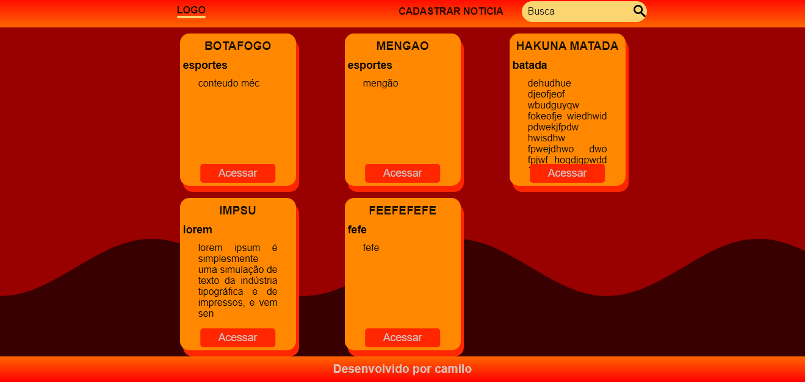
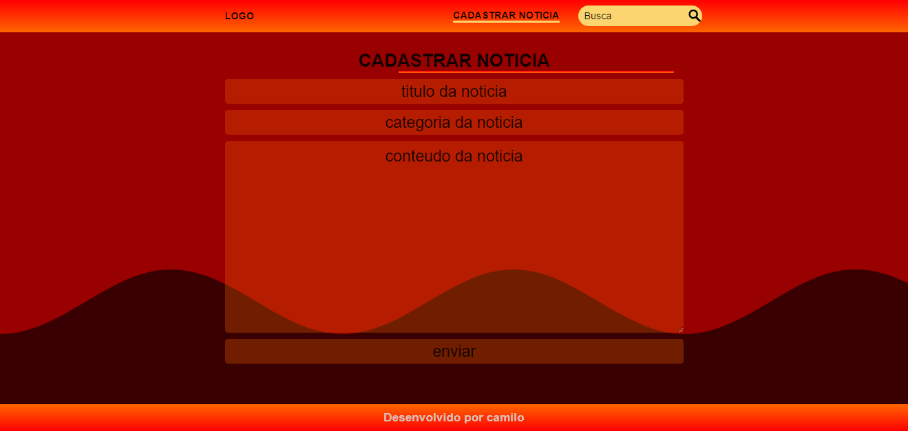
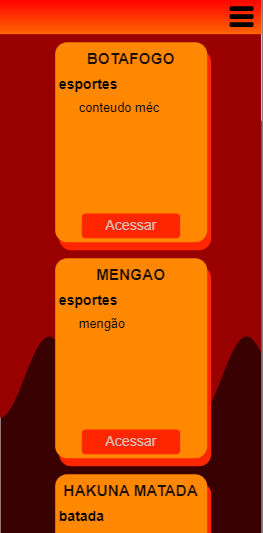
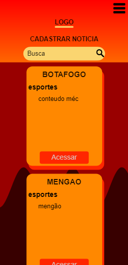
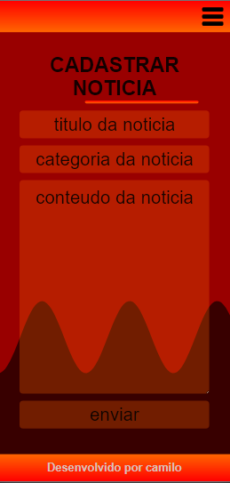

<h1 align="center"> Aplicação Web de notícias </h1>

## 🐱‍👤 Sobre

Primeiro projetinho para aprender **PHP** e desenvolver boas praticas no desenvolvimento web.

---
<h4 align="center"> 
	🚧   Em construção...  🚧
</h4>

---
## 👾Tecnologias Utilizadas

- PHP
- Javascript
- Html
- Css

## 🐱‍🐉Como baixar o projeto

### Pré-requisitos

Antes de começar, você vai precisar ter instalado em sua máquina as seguintes ferramentas:
[Git](https://git-scm.com), [Xampp](https://www.apachefriends.org/pt_br/index.html). 
Além disto é bom ter um editor para trabalhar com o código como [VSCode](https://code.visualstudio.com/)

### 🎲 Passos para executar o projeto em sua máquina
1. Baixe e instale o XAMPP em sua máquina
2. Clone ou baixe o repositório
3. Extraia todos os arquivos e mova-os para a pasta 'htdocs' do seu diretório XAMPP.
4. Inicie o Apache e o Mysql no painel de controle do XAMPP.
5. Abra seu navegador e digite 'localhost / phpmyadmin'
Na página phpmyadmin, crie um novo banco de dados no painel esquerdo e nomeie como 'mysqldb'
7. Importe o arquivo 'mysqldb.sql' dentro do banco de dados recém-criado e clique em ok.
8. Abra uma nova guia e digite 'localhost/noticiaPHP' no url do seu navegador
9. Viva! É isso aí!

## 🤳Telas da aplicação

<dl> 
  <dt>Telas Web Desktop</dt>
  <dd></dd>
  <dd></dd>

---
<dt>Telas Web Mobile</dt>
  <dd></dd>
  <dd></dd>
  <dd></dd>

</dl>

---
Desenvolvido por Camilo Lopes.